I build things people actually use. Speed, clean code, interfaces that stay out of the way. From the sketch to going live, in Langenfeld.

### What I'm working on

**[Synaplan](https://github.com/metadist/synaplan)** at [metadist](https://github.com/metadist)  
A self-hosted AI platform. Backend, apps, plugins. [synaplan.com](https://www.synaplan.com/)

**[OnlyWhisper](https://github.com/cristiangrxs/onlywhisper)**  
Dictation in the Mac menu bar. Audio stays on the device. [onlywhisper.dev](https://onlywhisper.dev)

**[Mein Langenfeld](https://mein-langenfeld.de)**  
A city site for Langenfeld. I write it and I build it.

**[Squad Allstars Germany](https://github.com/Squad-Allstars-Germany)**  
A Squad community. Servers, bots, stats, and a few public plugins. [sq-allstars.de](https://sq-allstars.de)

UptimeSentry. Infrastructure, since 2025.

PHP · TypeScript · JavaScript · Swift · Laravel · Next.js · Vue · Docker

[cristiangrosu.de](https://cristiangrosu.de) · [mail@cristiangrosu.de](mailto:mail@cristiangrosu.de) · [LinkedIn](https://www.linkedin.com/in/aurel-cristian-grosu/) · [X](https://x.com/cristiangrxs)

<picture>
  <source media="(prefers-color-scheme: dark)" srcset="https://raw.githubusercontent.com/cristiangrxs/cristiangrxs/output/github-contribution-grid-snake-dark.svg" />
  <source media="(prefers-color-scheme: light)" srcset="https://raw.githubusercontent.com/cristiangrxs/cristiangrxs/output/github-contribution-grid-snake.svg" />
  
</picture>
